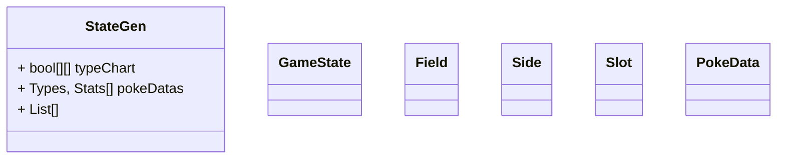

```mermaid
classDiagram
    class StateGen {
        + bool[][] typeChart
        + Types, Stats[] pokeDatas
        + List[]
    }  
    class GameState {

    }
    class Field {

    }
    class Side {

    }
    class Slot {

    }
    class PokeData {

    }
```