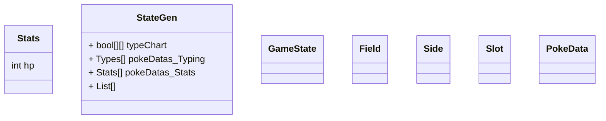

```mermaid
classDiagram
    class Stats {
        int hp
    }
    class StateGen {
        + bool[][] typeChart
        + Types[] pokeDatas_Typing
        + Stats[] pokeDatas_Stats
        + List[]
    }  
    class GameState {

    }
    class Field {

    }
    class Side {

    }
    class Slot {

    }
    class PokeData {

    }
```